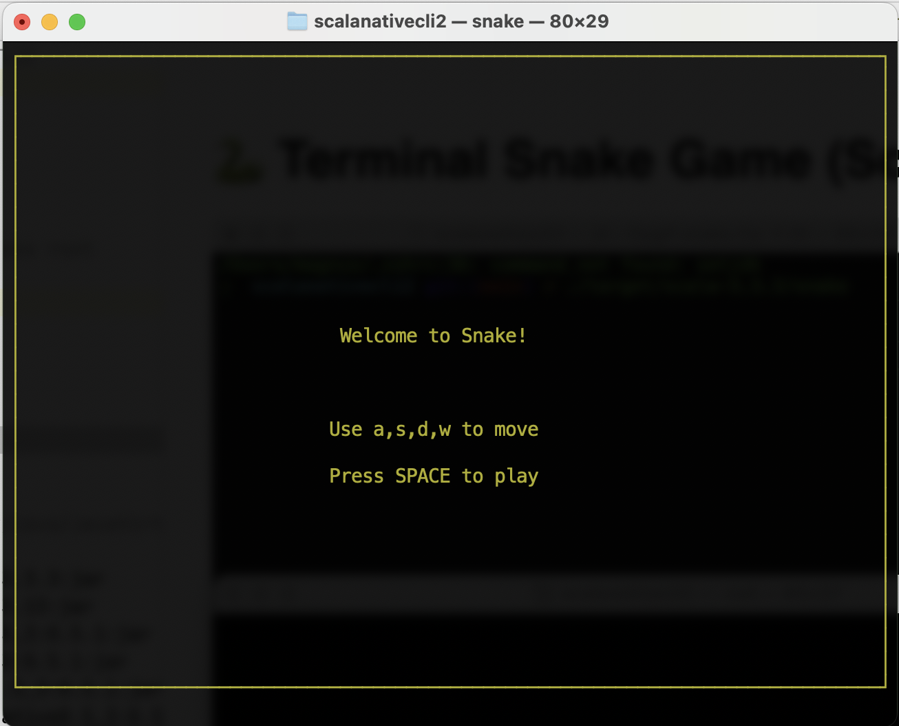
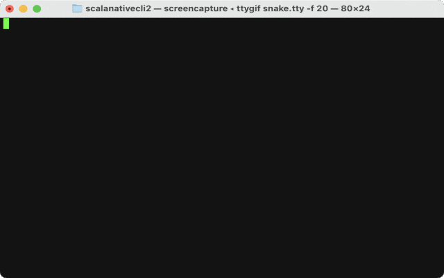

# 🐍 Terminal Snake Game (Scala Native)

A **classic Snake game** built in **Scala Native**, running directly in your terminal.

No need for external libraries—just **pure terminal magic**! ✨

<p align="center">
  
</p>

## 🎥 Gameplay

<p align="center">
  
</p>

## 🚀 Features
✅ **Resizable terminal support** (game adjusts dynamically)  
✅ **Real-time keyboard input** (no need to press Enter)  
✅ **Border & self-collision detection**  
✅ **Game-over & restart screen**

---

## 🎮 **How to Play**
- **Use `WASD` keys** to move the snake:
    - `W` → **Move Up**
    - `A` → **Move Left**
    - `S` → **Move Down**
    - `D` → **Move Right**
- **Eat the red food** (`●`) to grow
- **Avoid crashing** into the walls or yourself
- **Press `q` to quit the game**

---

## 🔧 **Installation & Running the Game**
Make sure you have **sbt** installed:
```sh
brew install scala sbt       # macOS (Homebrew)
sbt nativeLink               # Compile to native binary
./target/scala-3.3.3/snake   # Run the game
```